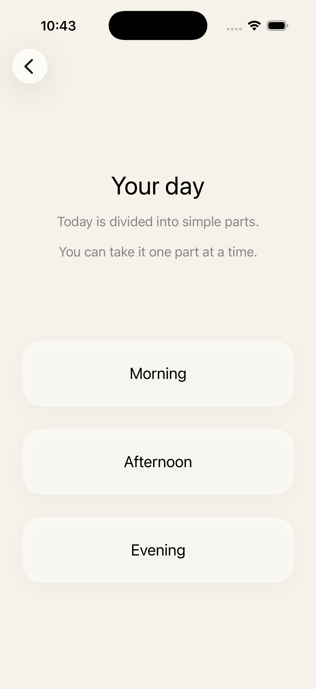

# Still

Still is a calm, humane SwiftUI companion designed to gently help people in the early stages of dementia re-anchor themselves in time, identity, and the present moment.

Built for the Apple Swift Student Challenge.

---

## Inspiration

Still was created to explore how technology can support people experiencing early cognitive fragility in a calm and emotionally safe way. The project focuses on reducing disorientation and anxiety through simple, predictable, and accessible interaction design.

---

## Features

- Gentle day orientation
- Familiar people and places
- Present-moment grounding
- Accessibility-first interface
- Calm and predictable navigation
- Offline-only experience

---

## Screenshots

### Home Screen

### Day Overview

### Morning Routine

### What Matters

### This Moment

---

## Design Philosophy

Still was designed around emotional safety and cognitive accessibility. Instead of overwhelming users with features or adaptive systems, the app focuses on predictability, clarity, and calm interaction.

The app is structured around three emotional anchors:

- Time → “What’s my day like?”
- Identity → “What Matters”
- Presence → “This Moment”

Every screen was intentionally simplified to reduce cognitive load while preserving dignity and emotional comfort.

---

## Accessibility

Accessibility shaped the entire structure of the app.

- Minimal choices reduce decision fatigue
- Large typography improves readability
- Predictable navigation increases cognitive safety
- Stable, non-random content reduces confusion
- Calm language avoids pressure and instruction-heavy interaction

---

## Built With

- Swift
- SwiftUI
- NavigationStack
- Xcode

---

## Status

Final Apple Swift Student Challenge submission.
